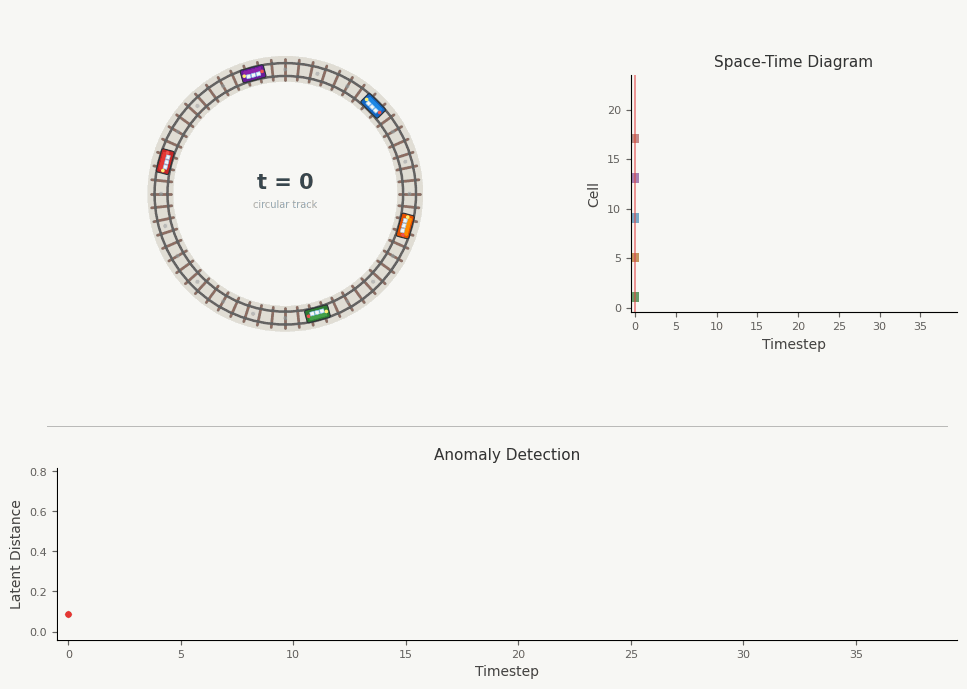
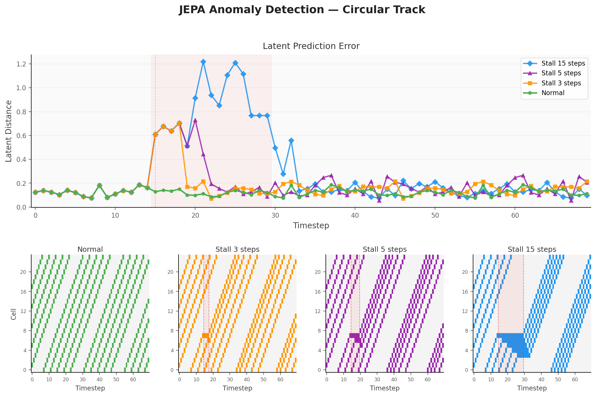

# Toy-Transit-JEPA

A minimal PyTorch proof-of-concept: a **Joint-Embedding Predictive Architecture (JEPA)** that learns transit dynamics in latent space and detects anomalies via latent distance.

<p align="center">
  
</p>

## Overview

Trains move clockwise on a circular track. A context encoder $E_\theta$ maps each state to a latent vector, and a predictor $P_\psi$ forecasts the next latent state from the current one. A target encoder $E_\phi$ (EMA copy of $E_\theta$) provides the learning signal. The model is trained to minimize prediction error in latent space — when a train stalls, this error spikes.

$s_t = E_\theta(x_t), \quad \hat{s}_{t+1} = P_\psi(s_t), \quad s_{t+1}^{\text{target}} = E_\phi(x_{t+1})$

$\mathcal{L} = \| \hat{s}_{t+1} - s_{t+1}^{\text{target}} \|_2^2, \quad \phi \leftarrow \tau \phi + (1 - \tau)\theta \quad (\tau = 0.99)$

## Anomaly Detection

The JEPA is trained on normal dynamics and then evaluated on perturbed scenarios where a single train stalls for varying durations (3, 5, 15 steps). Longer stalls cause trailing trains to pile up, producing a sustained spike in latent prediction error.

<p align="center">
  
</p>

## Usage

```bash
uv sync
uv run python -m src.eval    # train + evaluate → anomaly_dashboard.png
uv run pytest tests/          # run tests
```

## Structure

```
src/
  env.py             # Circular track environment (24 cells, 5 trains)
  jepa.py            # JEPA model (encoders + predictor)
  train.py           # Self-supervised training loop
  eval.py            # Evaluation scenarios + dashboard
tests/               # Property-based & unit tests
viz/
  generate_gif.py    # Animated GIF generation
```
